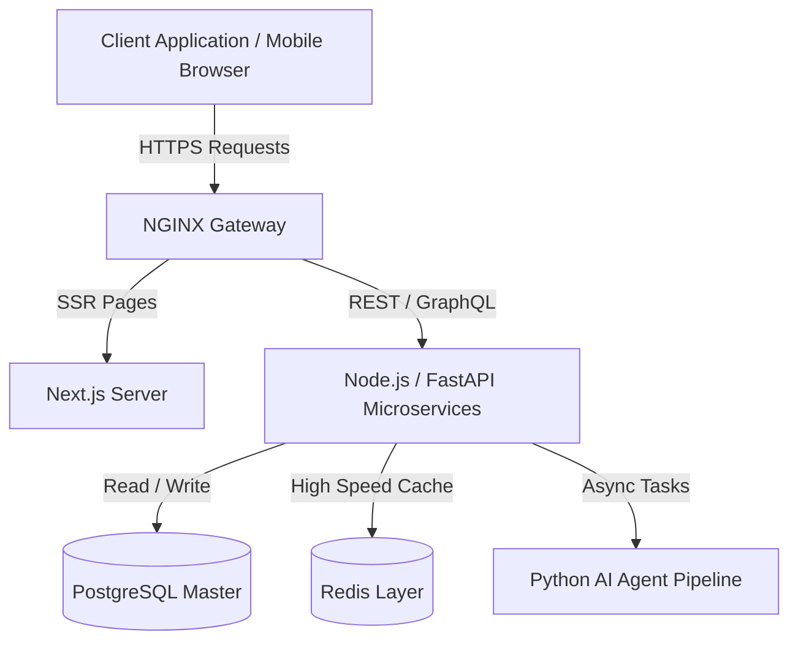

<!-- ========================================================================== -->
<!-- DEEPCHAND KUMAWAT - GOD-TIER ULTIMATE GITHUB PROFILE MASTERPIECE             -->
<!-- ========================================================================== -->

<div align="center">

  <!-- DYNAMIC ANIMATED NEON WAVE BANNER -->
  

  <br />

  <!-- DYNAMIC TYPEWRITER SUBTITLE -->
  

  <br />

  <!-- PRIMARY SOCIAL HUB BADGES -->
  <p align="center">
    <a href="https://www.linkedin.com/in/deepchand-kumawat-436788321/" target="_blank"></a>
    &nbsp;
    <a href="https://github.com/deepchandkhowal123" target="_blank"></a>
    &nbsp;
    <a href="mailto:deepchandkhowal@example.com"></a>
    &nbsp;
    <a href="https://deepchandkhowal123.github.io" target="_blank"></a>
  </p>

  <!-- LIVE METRICS & STATUS BADGES -->
  <p align="center">
    
    &nbsp;
    
    &nbsp;
    
    &nbsp;
    
  </p>

</div>

<br />

---

### ⚡ System Status & Developer Diagnostics

```bash
 🔴 🟡 🟢 deepchand@kumawat-dev ~ % neofetch --verbose
 
  SYSTEM          Deepchand Kumawat v2.5 (God-Tier Edition)
  ROLE            Full-Stack & AI Software Engineer
  LOCATION        India 🇮🇳
  CORE_STACK      React · Next.js · Node.js · Python · AI/ML
  CURRENT_FOCUS   Building Autonomous AI Agents & Distributed Cloud Services
  PHILOSOPHY      "Keep it simple, make it scale, write clean code."
  STATUS          🟢 Available for Full-Time Engineering Roles & Technical Partnerships
```

---

### 🚀 Executive Overview & Career Vision

I am **Deepchand Kumawat**, a **Full-Stack & AI Engineer** specializing in architecting resilient distributed applications, high-performance web UIs, and automated artificial intelligence workflows.

- 🔭 **Current Focus**: Next.js 14 App Router, Async Python APIs, Agentic RAG Workflows, and Distributed Caching.
- 🌱 **Learning & Research**: Microservices Event-Driven Architecture and Advanced LLM Fine-Tuning.
- 💬 **Core Stack**: JavaScript, TypeScript, React, Node.js, Python, PostgreSQL, MongoDB, Redis, and System Design.
- ⚡ **Engineering Mindset**: Turning complex, ambiguous technical problems into clean, testable, and production-ready code ☕💻.

---

### 🛠️ Technical Skill Matrix & Proficiency

```
┌─────────────────┬─────────────────────────────────────────────────────────────┬──────────┐
│ Category        │ Technologies & Tools                                        │ Level    │
├─────────────────┼─────────────────────────────────────────────────────────────┼──────────┤
│ Frontend        │ React.js · Next.js 14 · TypeScript · Tailwind CSS · Redux   │ █ █ █ █  │
│ Backend         │ Node.js · Express · Python · FastAPI · Django · REST      │ █ █ █ █  │
│ Databases       │ PostgreSQL · MongoDB · Redis · MySQL                        │ █ █ █ ░  │
│ AI & ML         │ PyTorch · TensorFlow · OpenCV · Pandas · LangChain · OpenAI │ █ █ █ ░  │
│ DevOps & Cloud  │ Docker · Git · GitHub Actions · AWS · NGINX · Linux         │ █ █ █ ░  │
└─────────────────┴─────────────────────────────────────────────────────────────┴──────────┘
```

<details open>
<summary><b>🎨 Frontend Engineering Stack</b></summary>
<br />
<p>
   &nbsp;
   &nbsp;
   &nbsp;
   &nbsp;
   &nbsp;
  
</p>
</details>

<details open>
<summary><b>⚙️ Backend Engineering & Databases</b></summary>
<br />
<p>
   &nbsp;
   &nbsp;
   &nbsp;
   &nbsp;
   &nbsp;
   &nbsp;
  
</p>
</details>

<details open>
<summary><b>🤖 AI / ML & Infrastructure</b></summary>
<br />
<p>
   &nbsp;
   &nbsp;
   &nbsp;
   &nbsp;
  
</p>
</details>

---

### 🏗 Architecture & System Flow



---

### 📊 GitHub Analytics & Engineering Metrics

<div align="center">
  
  
</div>

<br />

<div align="center">
  
</div>

---

### 🔥 Featured Portfolio Projects

### 🤖 1. AI Code Assistant & Automated Reviewer
> Intelligent developer assistant for automated code generation, syntax optimization, and bug fixing.
- **Key Capabilities:** Real-time AST code parsing, automated PR reviews, async streaming APIs.
- **Tech Stack:** `Python` · `FastAPI` · `React` · `OpenAI API` · `TailwindCSS`
- **Links:** [](https://github.com/deepchandkhowal123/ai-code-assistant) &nbsp; [](https://demo.com)

<br />

### 💻 2. Full-Stack SaaS Analytics Platform
> Multi-tenant enterprise dashboard featuring real-time analytics streaming, authentication, and billing.
- **Key Capabilities:** Role-based access control (RBAC), Stripe checkout integration, Sub-50ms queries.
- **Tech Stack:** `Next.js 14` · `TypeScript` · `Node.js` · `MongoDB` · `Stripe API`
- **Links:** [](https://github.com/deepchandkhowal123/fullstack-saas) &nbsp; [](https://demo.com)

<br />

### ⚡ 3. Microservices E-Commerce Engine
> Scalable backend microservices architecture designed for high throughput and sub-millisecond caching.
- **Key Capabilities:** Redis Pub/Sub event messaging, PostgreSQL ACID transaction isolation, Dockerized workflow.
- **Tech Stack:** `Node.js` · `Express` · `PostgreSQL` · `Redis` · `Docker`
- **Links:** [](https://github.com/deepchandkhowal123/ecommerce-api) &nbsp; [](https://demo.com)

---

### 🏆 Achievements & Badges

<div align="center">
  
</div>

---

### 🌐 Connect With Me

<div align="center">

  <a href="https://www.linkedin.com/in/deepchand-kumawat-436788321/" target="_blank">
    
  </a>
  &nbsp;&nbsp;
  <a href="https://github.com/deepchandkhowal123" target="_blank">
    
  </a>
  &nbsp;&nbsp;
  <a href="mailto:deepchandkhowal@example.com">
    
  </a>
  &nbsp;&nbsp;
  <a href="https://deepchandkhowal123.github.io" target="_blank">
    
  </a>

</div>

<br />

<div align="center">
  
</div>
