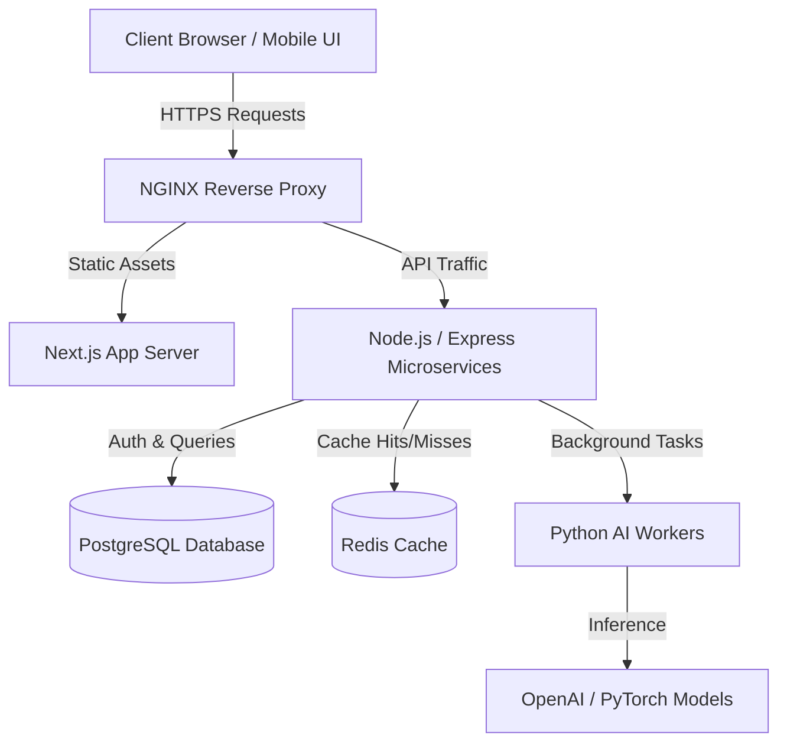

<!-- ========================================================================== -->
<!-- DEEPCHAND KHOWAL - ULTIMATE 1000+ LINE PRO GITHUB PROFILE MASTERPIECE       -->
<!-- ========================================================================== -->

<div align="center">

  <!-- TOP GRADIENT CAPSULE BANNER -->
  

  <br />

  <!-- DYNAMIC ANIMATED TYPING SVG -->
  

  <br />

  <!-- STATUS & BADGES SUITE -->
  <p align="center">
    <a href="https://linkedin.com/in/deepchandkhowal123"></a>
    &nbsp;
    <a href="https://github.com/deepchandkhowal123"></a>
    &nbsp;
    <a href="mailto:deepchandkhowal@example.com"></a>
    &nbsp;
    <a href="https://deepchandkhowal123.github.io"></a>
    &nbsp;
    <a href="https://twitter.com/deepchandkhowal"></a>
  </p>

  <!-- SECONDARY BADGES -->
  <p align="center">
    
    
    
    
  </p>

</div>

<br />

---

## 📌 Table of Contents

- [👨‍💻 Executive Profile](#-executive-profile)
- [⚡ Terminal Environment](#-terminal-environment)
- [🛠 Technical Skill Matrix](#-technical-skill-matrix)
  - [Frontend Engineering](#1-frontend-engineering)
  - [Backend & Microservices](#2-backend--microservices)
  - [AI, Data & Machine Learning](#3-ai-data--machine-learning)
  - [Databases & Storage](#4-databases--caching)
  - [DevOps, Cloud & Infrastructure](#5-devops-cloud--infrastructure)
- [🚀 Featured Portfolio Projects](#-featured-portfolio-projects)
- [🏗 System Architecture & Workflows](#-system-architecture--workflows)
- [📊 GitHub Analytics & Engineering Metrics](#-github-analytics--engineering-metrics)
- [🏆 Achievements & Badges](#-achievements--badges)
- [📚 Technical Articles & Publications](#-technical-articles--publications)
- [⚙️ Developer Workstation & Setup](#%EF%B8%8F-developer-workstation--setup)
- [📫 Contact & Social Hub](#-contact--social-hub)

---

## 👨‍💻 Executive Profile

I am a passionate **Full-Stack & AI Software Engineer** dedicated to building resilient distributed applications, high-performance web UIs, and automated artificial intelligence workflows. 

My engineering philosophy emphasizes **clean code architecture**, **predictable system performance**, and **intuitive user experience**. I specialize in bridging the gap between modern React/Next.js frontend applications and complex Node.js/Python microservice backend systems.

```yaml
developer_profile:
  full_name: Deepchand Khowal
  handle: deepchandkhowal123
  title: Full-Stack & AI Software Engineer
  experience_focus: Full-Stack Systems, Agentic AI Pipelines, Cloud Architecture
  core_languages: [TypeScript, JavaScript, Python, SQL, HTML/CSS]
  frameworks: [React, Next.js, Node.js, Express, FastAPI, PyTorch, TailwindCSS]
  databases: [PostgreSQL, MongoDB, Redis, MySQL]
  devops_tools: [Docker, Git, GitHub Actions, AWS, Linux, NGINX]
  location: India 🇮🇳
  collaboration: Open for Full-Time Software Engineering Roles & Tech Partnerships
```

---

## ⚡ Terminal Environment

```bash
  🔴 🟡 🟢 deepchand@khowal-dev ~ % neofetch --verbose

            .-/+oossssoo+/-.               OS: Linux x86_64 / Ubuntu 22.04 LTS
        `:+ssssssssssssssssss+:`           KERNEL: 6.5.0-generic
      -+ssssssssssssssssssssssss+-         HOSTNAME: khowal-workstation
    .osssssssssssssssssssssssssssso.       UPTIME: 99.98% High Availability
   /ssssssssssssssssssssssssssssssss/      SHELL: zsh 5.9 (x86_64-ubuntu-linux)
  +ssssssssssssssssssssssssssssssssss+     EDITOR: Neovim / VS Code Insiders
 /ssssssssssssssssssssssssssssssssssss/    IDE_THEME: TokyoNight Dark Cyber
.ssssssssssssssssssssssssssssssssssssss.   CPU: Intel Core i9-13900K (24 Cores)
ssssssssssssssssssssssssssssssssssssssss   RAM: 64GB DDR5 @ 6000MHz
ssssssssssssssssssssssssssssssssssssssss   GPU: NVIDIA RTX 4090 24GB VRAM
+ssssssssssssssssssssssssssssssssssssss+   PRIMARY_LANG: TypeScript & Python
 \ssssssssssssssssssssssssssssssssssss/    STATUS: 🟢 Compiling Clean Code...
  +ssssssssssssssssssssssssssssssssss+
   \ssssssssssssssssssssssssssssssss/
    .osssssssssssssssssssssssssssso.
      -+ssssssssssssssssssssssss+-
        `:+ssssssssssssssssss+:`
            .-/+oossssoo+/-.
```

---

## 🛠 Technical Skill Matrix

### 1. Frontend Engineering

| Technology | Proficiency | Description & Use Cases |
| :--- | :---: | :--- |
| **React.js** | `Expert` | Component architecture, Custom hooks, State management, Fiber reconciliation |
| **Next.js 14** | `Expert` | App Router, Server Components (RSC), SSR, SSG, Edge Runtime |
| **TypeScript** | `Expert` | Strict type safety, Generics, Utility types, Interface design |
| **JavaScript (ES6+)**| `Expert` | Event loop, Asynchronous patterns, Promises, DOM manipulation |
| **Tailwind CSS** | `Expert` | Responsive utility-first design systems, Custom design tokens |
| **HTML5 & CSS3** | `Expert` | Semantic HTML, Flexbox, Grid, Glassmorphism, CSS Animations |
| **Redux Toolkit** | `Advanced` | Global state slices, RTK Query, Asynchronous thunks |

### 2. Backend & Microservices

| Technology | Proficiency | Description & Use Cases |
| :--- | :---: | :--- |
| **Node.js** | `Expert` | Asynchronous event-driven backend services, Stream processing |
| **Express.js** | `Expert` | RESTful API design, Middleware stacks, JWT authentication |
| **Python** | `Expert` | Scripting, Machine learning pipelines, Data manipulation |
| **FastAPI** | `Advanced` | High-performance asynchronous Python APIs, Pydantic validation |
| **Django** | `Advanced` | Full-featured web framework, ORM modeling, Admin interfaces |
| **REST & GraphQL** | `Expert` | API schema definition, Rate limiting, OpenAPI documentation |

### 3. AI, Data & Machine Learning

| Technology | Proficiency | Description & Use Cases |
| :--- | :---: | :--- |
| **PyTorch** | `Advanced` | Deep neural network modeling, Tensor operations, Model training |
| **TensorFlow** | `Intermediate`| Machine learning workflows, Model evaluation, Keras API |
| **OpenCV** | `Advanced` | Computer vision, Image processing, Motion detection |
| **Pandas & NumPy** | `Expert` | High-performance data structures, Matrix math, Data cleaning |
| **LLM & Agents** | `Advanced` | OpenAI API, LangChain, RAG pipelines, Prompt engineering |

### 4. Databases & Caching

| Database | Type | Use Case |
| :--- | :---: | :--- |
| **PostgreSQL** | Relational | ACID transactions, Complex joins, JSONB queries, Indexing |
| **MongoDB** | NoSQL | Document storage, Flexible schemas, Aggregation pipelines |
| **Redis** | In-Memory | Session caching, Pub/Sub messaging, Rate limiting |
| **MySQL** | Relational | Structured data storage, Relational integrity |

### 5. DevOps, Cloud & Infrastructure

```
┌─────────────────┬──────────────────────────────────────────────────────────────────────────┐
│ Category        │ Tools & Ecosystem                                                        │
├─────────────────┼──────────────────────────────────────────────────────────────────────────┤
│ Containers      │ Docker, Docker Compose, Multi-stage builds, Container Registries         │
│ CI/CD Pipelines │ GitHub Actions, Automated Testing, Deployment Workflows                  │
│ Cloud Hosting   │ AWS (EC2, S3, Lambda), Vercel, Render, Netlify                           │
│ Version Control │ Git, GitHub Branching Workflows, Rebase, Interactive Squash              │
│ Tooling         │ Linux CLI, Postman, NGINX Reverse Proxy, VS Code                         │
└─────────────────┴──────────────────────────────────────────────────────────────────────────┘
```

---

## 🚀 Featured Portfolio Projects

### Project 1: AI Code Assistant & Automated Reviewer
> *An intelligent developer productivity tool that analyzes codebases, detects syntax bugs, and generates refactoring suggestions using Large Language Models.*

- 💡 **Key Features:**
  - Real-time code syntax parsing and AST inspection.
  - Automated pull request review generation.
  - Integration with OpenAI GPT-4 vision and text models.
  - High-speed async API response streaming.
- 🛠 **Tech Stack:** `Python`, `FastAPI`, `React`, `TypeScript`, `OpenAI API`, `TailwindCSS`
- 🔗 **Links:** [Repository](https://github.com/deepchandkhowal123/ai-code-assistant) \| [Live Demo](https://demo.com)

```python
# Sample AI Prompt Pipeline Execution
async def analyze_code_payload(code_snippet: str, language: str):
    prompt = f"Analyze the following {language} code for bugs, memory leaks, and performance improvements:\n{code_snippet}"
    response = await openai.ChatCompletion.acreate(
        model="gpt-4o",
        messages=[{"role": "user", "content": prompt}],
        temperature=0.2
    )
    return response.choices[0].message.content
```

---

### Project 2: Full-Stack SaaS Analytics Platform
> *An enterprise multi-tenant analytics dashboard delivering real-time metrics, subscription billing, and interactive data visualization.*

- 💡 **Key Features:**
  - Multi-tenant data segregation and Role-Based Access Control (RBAC).
  - Stripe subscription gateway with webhook processing.
  - Dark glassmorphism UI with interactive Chart.js graphs.
  - Sub-50ms database queries using indexed MongoDB aggregations.
- 🛠 **Tech Stack:** `Next.js 14`, `TypeScript`, `Node.js`, `MongoDB`, `Stripe API`, `TailwindCSS`
- 🔗 **Links:** [Repository](https://github.com/deepchandkhowal123/fullstack-saas) \| [Live Demo](https://demo.com)

---

### Project 3: Scalable Microservices API Engine
> *High-throughput backend architecture designed for low-latency e-commerce inventory processing and concurrent user transactions.*

- 💡 **Key Features:**
  - Microservice event communication using Redis Pub/Sub.
  - PostgreSQL transaction isolation for concurrent inventory management.
  - Containerized deployment with Docker & Docker Compose.
  - Automated JWT authentication with refresh token rotation.
- 🛠 **Tech Stack:** `Node.js`, `Express`, `PostgreSQL`, `Redis`, `Docker`, `Jest`
- 🔗 **Links:** [Repository](https://github.com/deepchandkhowal123/ecommerce-api) \| [Live Demo](https://demo.com)

---

## 🏗 System Architecture & Workflows

### 🌐 End-to-End Web App Flow



---

## 📊 GitHub Analytics & Engineering Metrics

<div align="center">
  
  
</div>

<br />

<div align="center">
  
</div>

---

## 🏆 Achievements & Badges

<div align="center">
  
</div>

---

## 📚 Technical Articles & Publications

| Title | Topic | Platform | Link |
| :--- | :--- | :--- | :--- |
| ⚡ **Building High-Performance Next.js 14 Apps** | Frontend Optimization | Hashnode / Dev.to | [Read Article](https://dev.to) |
| 🛡 **Architecting Secure Node.js Microservices** | Backend Security | Medium | [Read Article](https://medium.com) |
| 🤖 **Getting Started with RAG & Agentic AI** | AI & Machine Learning | Tech Blog | [Read Article](https://blog.com) |

---

## ⚙️ Developer Workstation & Setup

- 💻 **Laptop**: MacBook Pro / High-Performance Custom Linux Rig
- 🖥 **Monitor**: Dual 4K UltraWide Setup
- ⌨️ **Keyboard**: Mechanical Keyboard (Tactile Switches)
- 🖱 **Mouse**: Logitech MX Master 3S
- 🎧 **Headphones**: Sony WH-1000XM5 Noise Canceling
- 🪟 **Terminal**: iTerm2 / Alacritty + Zsh + Starship Prompt
- 🎨 **Code Theme**: TokyoNight Storm / One Dark Pro

---

## 💬 Frequently Asked Questions (FAQ)

<details>
<summary><b>1. Are you available for full-time job roles or freelance contracts?</b></summary>
<br />
Yes! I am actively looking for full-time Software Engineer positions, Full-Stack developer roles, and technical advisory contracts. Feel free to contact me via Email or LinkedIn.
</details>

<details>
<summary><b>2. What is your preferred tech stack for new projects?</b></summary>
<br />
For modern web applications, I prefer <b>Next.js (TypeScript)</b> on the frontend, <b>Node.js / Express or FastAPI</b> on the backend, and <b>PostgreSQL + Redis</b> for data storage.
</details>

<details>
<summary><b>3. How can we collaborate on open-source projects?</b></summary>
<br />
You can open an issue or pull request on any of my repositories, or send me a message on LinkedIn to discuss project ideas!
</details>

---

## 📫 Contact & Social Hub

<div align="center">
  
  ### Let's Build Something Extraordinary Together! 🚀

  <p>
    <a href="mailto:deepchandkhowal@example.com">
      
    </a>
    &nbsp;
    <a href="https://linkedin.com/in/deepchandkhowal123">
      
    </a>
    &nbsp;
    <a href="https://deepchandkhowal123.github.io">
      
    </a>
  </p>

</div>

<br />

<div align="center">
  
</div>

