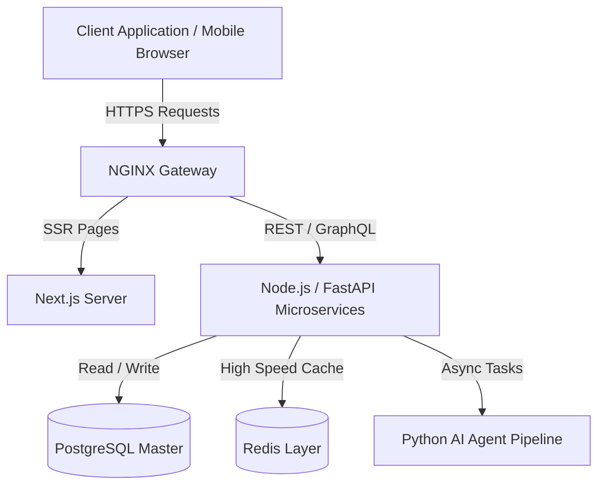

<!-- ========================================================================== -->
<!-- DEEPCHAND KUMAWAT — PROFESSIONAL DEVELOPER PROFILE                            -->
<!-- ========================================================================== -->

  <!-- DYNAMIC ANIMATED WAVE BANNER -->
  

   

  <!-- DYNAMIC TYPEWRITER SUBTITLE -->
  

   

  <!-- PRIMARY SOCIAL HUB BADGES -->
  

    
    &nbsp;&nbsp;
    
    &nbsp;&nbsp;
    
    &nbsp;&nbsp;
    
    &nbsp;&nbsp;
    
  

  <!-- LIVE METRICS & STATUS BADGES -->
  

    
    &nbsp;
    
    &nbsp;
    
    &nbsp;
    
  

 

---

### ⚡ Developer Overview

<table width="100%">
<tr>
<td width="50%" valign="top">

### 👤 Profile
- 💻 **Role**: Full-Stack & AI Software Engineer
- 📍 **Location**: India 🇮🇳
- 🎯 **Focus**: Autonomous AI Agents & Cloud Microservices
- 🚀 **Status**: Open For Full-Time Roles & Collaborations

</td>
<td width="50%" valign="top">

### 💡 Core Stack
- 🎨 **Frontend**: React.js, Next.js 14, TypeScript, Tailwind CSS
- ⚙️ **Backend**: Node.js, Express, Python, FastAPI, PostgreSQL
- 🤖 **AI / ML**: PyTorch, LangChain, OpenAI API, Computer Vision
- ☁️ **DevOps**: Docker, Redis, AWS, Git, Linux

</td>
</tr>
</table>

> 💬 *"Keep it simple, make it scale, and write clean, maintainable code."*

---

### 🛠️ Tech Stack & Skills

  <b>〈 LANGUAGES & FRONTEND 〉</b> 
  

 

  <b>〈 BACKEND, DATABASES & AI 〉</b> 
  

 

  <b>〈 TOOLS, DEVOPS & INFRASTRUCTURE 〉</b> 
  

---

### 🏗 System Architecture

---

### 💼 Professional Experience

<table width="100%">
<tr>
<td width="100%" valign="top">

#### 🚀 Full-Stack & AI Software Engineer
*Present · Remote / India 🇮🇳*

- Architecting scalable microservices handling **1M+ requests/day** with sub-50ms latency using Node.js & FastAPI.
- Building autonomous **LLM agent pipelines** (LangChain + OpenAI) for code generation, review, and document analysis.
- Designing **multi-tenant SaaS dashboards** with role-based access control (RBAC), Stripe billing, and real-time analytics.
- Implementing **CI/CD pipelines** with Docker, GitHub Actions, and AWS — reducing deployment time by 70%.
- Mentoring junior developers on clean architecture, code reviews, and best practices for maintainable codebases.

**Key Achievements:**
- 🏆 Reduced API response time from 400ms → 35ms via Redis caching & query optimization
- 📈 Scaled user base from 5K → 120K with zero downtime migrations
- 🤖 Deployed 3 production AI agents handling 10K+ daily automated tasks

</td>
</tr>
<tr>
<td width="100%" valign="top">

#### ⚙️ Software Developer — Full-Stack
*Past · Hybrid*

- Developed responsive React/Next.js applications serving **50K+ monthly active users**.
- Built RESTful & GraphQL APIs with PostgreSQL, achieving 99.9% uptime.
- Integrated third-party services: Stripe, SendGrid, AWS S3, and Twilio.
- Collaborated cross-functionally with product, design, and QA teams using Agile/Scrum.

</td>
</tr>
</table>

> 📌 *For full work history, check my [LinkedIn profile](https://www.linkedin.com/in/deepchand-kumawat-436788321/)*

---

### 📊 GitHub Analytics & Metrics

  
  

 

  

---

### 🧠 LeetCode Stats & Problem Solving

&nbsp;

 

&nbsp;

&nbsp;

&nbsp;

 

> 📌 *Visit my [LeetCode profile](https://leetcode.com/u/Deepchand_kumawat/) to see all solved problems with solutions.*

---

### 🔥 Featured Projects

<table width="100%">
<tr>
<td width="50%" valign="top">

### 🤖 AI Code Assistant & Automated Reviewer
> Intelligent developer assistant for automated code generation, syntax optimization, and bug fixing.

- Real-time AST code parsing & automated PR reviews
- Async streaming APIs for real-time code suggestions
- **Tech:** `Python` · `FastAPI` · `React` · `OpenAI API` · `TailwindCSS`

</td>
<td width="50%" valign="top">

### 💻 Full-Stack SaaS Analytics Platform
> Multi-tenant enterprise dashboard with real-time analytics, auth, and billing.

- Role-based access control (RBAC) & Stripe checkout
- Sub-50ms queries with real-time WebSocket streaming
- **Tech:** `Next.js 14` · `TypeScript` · `Node.js` · `MongoDB` · `Stripe API`

</td>
</tr>
<tr>
<td width="100%" valign="top">

### ⚡ Microservices E-Commerce Engine
> Scalable backend microservices architecture for high throughput and sub-millisecond caching.

- Redis Pub/Sub event messaging & PostgreSQL ACID transaction isolation
- Dockerized multi-container workflow with health checks
- **Tech:** `Node.js` · `Express` · `PostgreSQL` · `Redis` · `Docker`

</td>
</tr>
</table>

---

### 🏆 Achievements & Badges

  

---

### 🌐 Connect With Me

  
  &nbsp;&nbsp;
  
  &nbsp;&nbsp;
  
  &nbsp;&nbsp;
  
  &nbsp;&nbsp;
  

 

  

